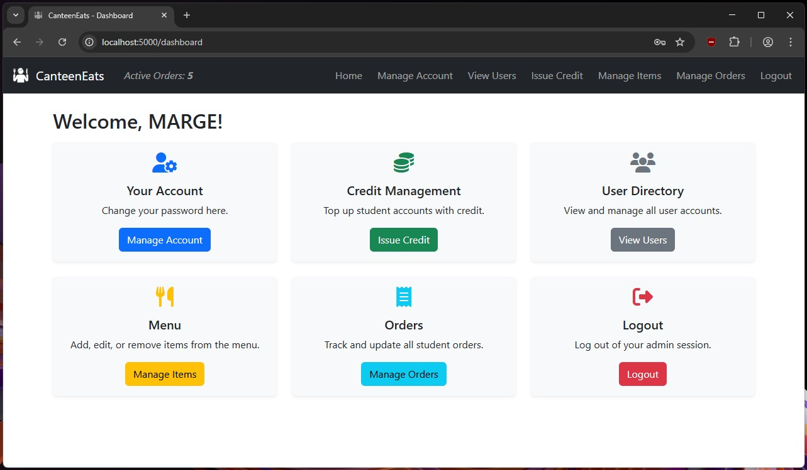

# CanteenEats – School Canteen Ordering System

CanteenEats is a Flask-based web application that digitizes the school canteen experience. It allows students to browse a live canteen menu, place orders with their prepaid credit, and track order status — while staff can manage users, credit, menu items, and fulfill orders. It was built from [my flask project template,](https://github.com/miketeachestech/hsc-software-engineering-flask-project-template) to demonstrate what a major work submission might look like for a Year 12 student undertaking the NESA HSC Software Engineering course.

## Screenshots




## Features

### Students
- View live store menu with filters (price, vegetarian, quantity)
- Place orders using available credit
- View personal order history and statuses
- Manage their own account (change password)
- See their available credit

### Staff
- Promote students to staff
- Add/edit/delete menu items with images
- View and manage all orders (status workflow + cancel with refund)
- View and manage all users
- Top up credit for student accounts
- Dashboard with quick access cards and active order counter

## Directory Structure

```
canteeneats/
│
├── app.py                  # Main Flask app
├── config.py               # App config (e.g. database path, secret key)
├── forms.py                # WTForms used throughout the app
├── models.py               # SQLAlchemy models for User, Item, Order
├── seed_db.py              # Database seeding for test data
├── helpers.py              # Utility functions
│
├── static/
│   ├── examples/           # Seed image source files
│   ├── images/             # UI assets (logo, favicon)
│   ├── uploads/            # Item images uploaded or copied
│   └── styles.css          # Custom styles
│
├── templates/              # All HTML templates (Jinja2)
│   ├── base.html           # Shared layout and navbar
│   ├── dashboard.html      # Staff/student dashboard
│   ├── store.html          # Store view for students
│   ├── order_item.html     # Place an order
│   ├── my_orders.html      # Student order history
│   ├── manage_orders.html  # Staff order management
│   ├── items.html          # Item list for staff
│   ├── item_form.html      # Add/edit item form
│   ├── users.html          # Staff user list
│   ├── edit_account.html   # Change password
│   ├── login.html          # Login page
│   └── register.html       # Registration page
│
├── documentation/
│   ├── BUSINESS_RULES.md
│   └── PROBLEM_DEFINITION.md
│   └── ...more!
│
├── app.db                  # SQLite database (auto-created)
├── requirements.txt        # Python dependencies
└── README.md               # You're here.
```

## Setup Instructions

1. **Clone this repo**

2. **Install dependencies**

```bash
pip install -r requirements.txt
```

3. **Ensure Config.RESET_DB_ON_LAUNCH is set to True to generate the database with example data on launch**

```bash
RESET_DB_ON_LAUNCH = True
```
> This will initialize the database and seed users, items, and orders. Turn this to False after your first time running the application. 

4. **Run the app (development mode)**

```bash
python app.py
```

5. **Login using test accounts**

| Role   | Email                      | Password   |
|--------|----------------------------|------------|
| Staff  | homer@school.com           | homer123   |
| Staff  | marge@school.com           | marge123   |
| Student| lisa@school.com            | lisa123    |
| Student| bart@school.com            | bart123    |
| Student| maggie@school.com          | maggie123  |

## License

MIT License — free to use, modify, and share for educational or personal projects. 
The logos and item images were generated using ChatGPT.